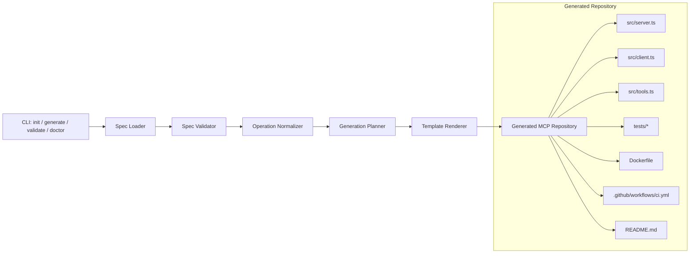

# v0.1 技术架构

## 包职责

- `packages/cli`：命令入口、参数解析、用户输出
- `packages/generator`：spec 加载、校验、标准化、文件生成
- `packages/runtime`：环境检查与共享运行时工具

## 当前实现策略

仓库内部先使用零依赖 Node.js 实现，降低冷启动成本。生成出的用户项目保持 TypeScript 方向，便于后续正式发布到 npm 时平滑升级。
